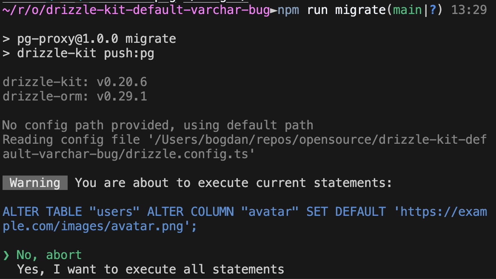

# Bug

## Instalment
```bash
npm i
docker-compose up
```
Then you will have a pg database sitting on your `5431` port with a db `bug` in it.

## Reproducing an error
```bash
npm run generate
npm run migrate
# then try to migrate once more, db is already migrated so no message should appear or changes be made
npm run migrate
```
After that drizzle-kit will allow to execute following sql `ALTER TABLE "users" ALTER COLUMN "avatar" SET DEFAULT 'https://example.com/images/avatar.png';`



Even though the database is already migrated and default value for column `avatar` is already have been set:


